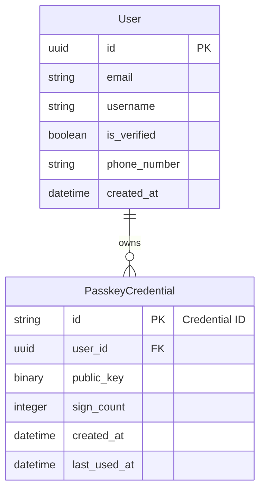

# Mexican Online Stock Trading Retail Brokerage Architecture

## Overview

This Mexican Online Stock Trading Retail Brokerage is built with an
agentic-first approach.

## Tech Stack

### Core Application

-   Frontend: Next.js (App Router)
-   Backend: Django (Django REST Framework)
-   Database: Postgres
-   Containerization: Docker

### Infrastructure & Background Processing

-   Cache & Broker: Redis
-   Async Tasks: Celery
-   Background Scheduling: Celery Beat

### Authentication & Authorization

-   Authentication: django auth + JWT (Simple JWT)
-   Rate Limiting: DRF Throttling / django-ratelimit

### API & Documentation

-   API Documentation: drf-spectacular (OpenAPI)

### Testing & Code Quality

-   Testing: pytest + pytest-django
-   Factories: factory_boy
-   Coverage: coverage.py
-   Linting (Python): ruff + black + isort
-   Linting (Frontend): ESLint + Prettier

### Observability & Monitoring

-   Error Tracking: Sentry (free tier)
-   Structured Logging: structlog
-   Metrics (optional): Prometheus + Grafana

### CI/CD

-   GitHub Actions (free tier)

## Data Model

## Directory Structure

-   `/ai`: contains agent contracts and workflow blueprints.
-   `/docs`: contains project documentation and feature specs.
-   `/backend`: contains the Django source code and migrations.
-   `/frontend`: contains the Next.js source code.
